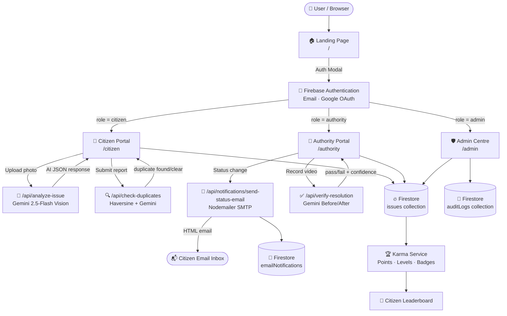

# 01 — System Overview

Full high-level architecture of Civic Sentinel.

```mermaid
flowchart TD
    U([👤 User / Browser]) --> LP[🏠 Landing Page\n/]
    LP -->|Auth Modal| AUTH[🔐 Firebase Authentication\nEmail · Google OAuth]
    AUTH -->|role = citizen| CP[📱 Citizen Portal\n/citizen]
    AUTH -->|role = authority| AP[👷 Authority Portal\n/authority]
    AUTH -->|role = admin| ADMIN[🛡️ Admin Centre\n/admin]

    CP -->|Upload photo| A1[🤖 /api/analyze-issue\nGemini 2.5-Flash Vision]
    CP -->|Submit report| A2[🔍 /api/check-duplicates\nHaversine + Gemini]
    CP --> FS[(🔥 Firestore\nissues collection)]

    AP -->|Record video| A3[✅ /api/verify-resolution\nGemini Before/After]
    AP -->|Status change| NOTIF[📧 /api/notifications/send-status-email\nNodemailer SMTP]
    AP --> FS

    ADMIN --> FS
    ADMIN --> AUDIT[(📜 Firestore\nauditLogs collection)]

    A1 -->|AI JSON response| CP
    A2 -->|duplicate found/clear| CP
    A3 -->|pass/fail + confidence| AP
    NOTIF -->|HTML email| CITIZEN_EMAIL([📬 Citizen Email Inbox])
    NOTIF --> NOTIFSAVE[(📨 Firestore\nemailNotifications)]

    FS --> KARMA[🏆 Karma Service\nPoints · Levels · Badges]
    KARMA --> LEADERBOARD[🥇 Citizen Leaderboard]
```
