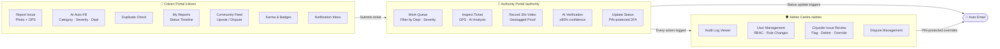

# 02 — Role-Based Portals

Three dedicated portals with strict RBAC.

```mermaid
flowchart LR
    subgraph Citizen["📱 Citizen Portal /citizen"]
        C1[Report Issue\nPhoto + GPS]
        C2[AI Auto-Fill\nCategory · Severity · Dept]
        C3[Duplicate Check]
        C4[My Reports\nStatus Timeline]
        C5[Community Feed\nUpvote / Dispute]
        C6[Karma & Badges]
        C7[Notification Inbox]
    end

    subgraph Authority["👷 Authority Portal /authority"]
        A1[Work Queue\nFilter by Dept · Severity]
        A2[Inspect Ticket\nGPS · AI Analysis]
        A3[Record 30s Video\nGeotagged Proof]
        A4[AI Verification\n≥80% confidence]
        A5[Update Status\nPIN-protected 2FA]
    end

    subgraph Admin["🛡️ Admin Centre /admin"]
        D1[Audit Log Viewer]
        D2[User Management\nRBAC · Role Changes]
        D3[Citywide Issue Review\nFlag · Delete · Override]
        D4[Dispute Management]
    end

    Citizen -- "Submits ticket" --> Authority
    Authority -- "Status update triggers" --> Email([📧 Auto Email])
    Authority -- "Every action logged" --> Admin
    Admin -- "PIN-protected overrides" --> Email
```
