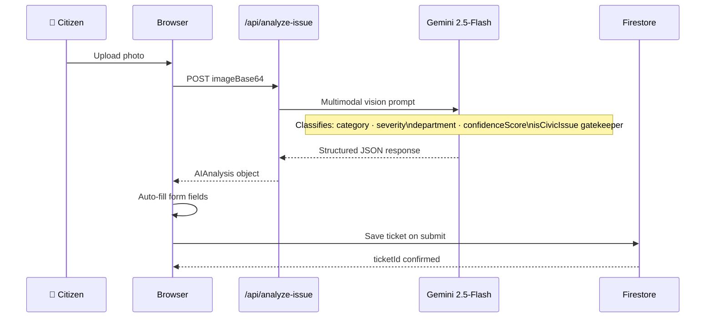

# 03 — AI Classification Pipeline

Gemini 2.5-Flash multimodal vision analyses every citizen photo.

```mermaid
sequenceDiagram
    participant C as 📱 Citizen
    participant B as Browser
    participant API as /api/analyze-issue
    participant G as Gemini 2.5-Flash
    participant FS as Firestore

    C->>B: Upload photo
    B->>API: POST imageBase64
    API->>G: Multimodal vision prompt
    Note over G: Classifies: category · severity\ndepartment · confidenceScore\nisCivicIssue gatekeeper
    G-->>API: Structured JSON response
    API-->>B: AIAnalysis object
    B->>B: Auto-fill form fields
    B->>FS: Save ticket on submit
    FS-->>B: ticketId confirmed
```
