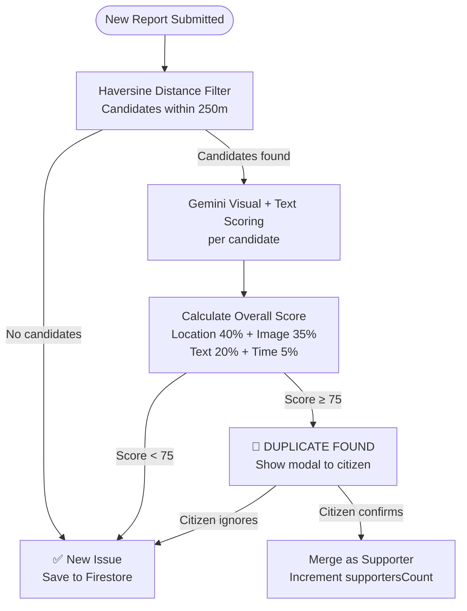

# 04 — Duplicate Detection Algorithm

Haversine spatial filter + Gemini visual scoring. Score ≥ 75 merges as duplicate.

```mermaid
flowchart TD
    NR([New Report Submitted]) --> HD[Haversine Distance Filter\nCandidates within 250m]
    HD -->|No candidates| NEW[✅ New Issue\nSave to Firestore]
    HD -->|Candidates found| GS[Gemini Visual + Text Scoring\nper candidate]
    GS --> SC[Calculate Overall Score\nLocation 40% + Image 35%\nText 20% + Time 5%]
    SC -->|Score ≥ 75| DUP[🔁 DUPLICATE FOUND\nShow modal to citizen]
    SC -->|Score < 75| NEW
    DUP -->|Citizen confirms| MERGE[Merge as Supporter\nIncrement supportersCount]
    DUP -->|Citizen ignores| NEW
```
