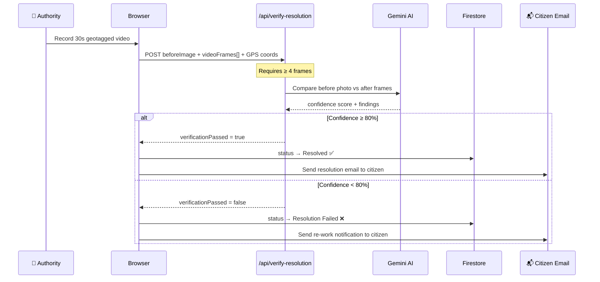

# 05 — AI Resolution Verification

Authority records on-site video. Gemini compares before photo vs after frames. 80% confidence required.

```mermaid
sequenceDiagram
    participant A as 👷 Authority
    participant B as Browser
    participant API as /api/verify-resolution
    participant G as Gemini AI
    participant FS as Firestore
    participant E as 📬 Citizen Email

    A->>B: Record 30s geotagged video
    B->>API: POST beforeImage + videoFrames[] + GPS coords
    Note over API: Requires ≥ 4 frames
    API->>G: Compare before photo vs after frames
    G-->>API: confidence score + findings

    alt Confidence ≥ 80%
        API-->>B: verificationPassed = true
        B->>FS: status → Resolved ✅
        B->>E: Send resolution email to citizen
    else Confidence < 80%
        API-->>B: verificationPassed = false
        B->>FS: status → Resolution Failed ❌
        B->>E: Send re-work notification to citizen
    end
```
