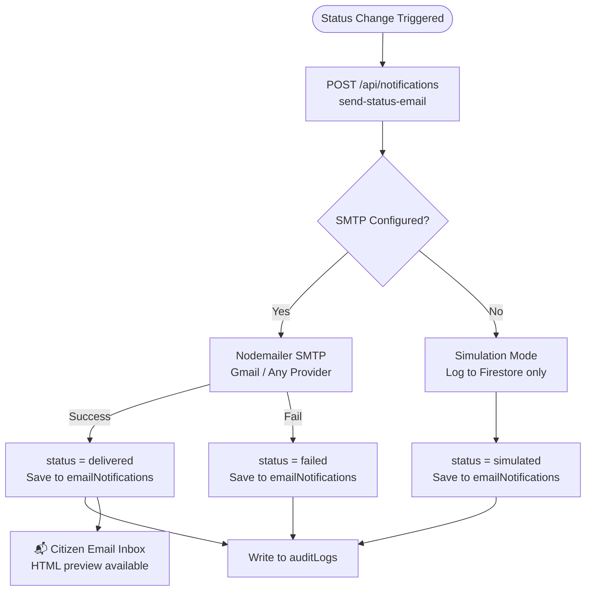

# 06 — Email Notification Flow

Every ticket status change triggers a branded HTML email via Nodemailer SMTP or simulation fallback.

```mermaid
flowchart TD
    SC([Status Change Triggered]) --> NF[POST /api/notifications\nsend-status-email]
    NF --> SC2{SMTP Configured?}
    SC2 -->|Yes| SMTP[Nodemailer SMTP\nGmail / Any Provider]
    SC2 -->|No| SIM[Simulation Mode\nLog to Firestore only]
    SMTP -->|Success| DEL[status = delivered\nSave to emailNotifications]
    SMTP -->|Fail| FAIL[status = failed\nSave to emailNotifications]
    SIM --> SIMSAVE[status = simulated\nSave to emailNotifications]
    DEL --> AUD[Write to auditLogs]
    FAIL --> AUD
    SIMSAVE --> AUD
    DEL --> CEI[📬 Citizen Email Inbox\nHTML preview available]
```
