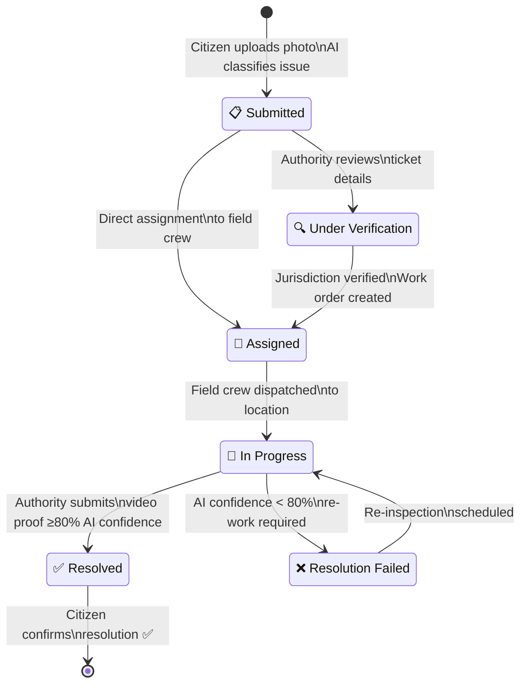

# 07 — Ticket Status Lifecycle

Full state machine — from citizen submission to final resolution.

```mermaid
stateDiagram-v2
    [*] --> Submitted : Citizen uploads photo\nAI classifies issue
    Submitted --> UnderVerification : Authority reviews\nticket details
    Submitted --> Assigned : Direct assignment\nto field crew
    UnderVerification --> Assigned : Jurisdiction verified\nWork order created
    Assigned --> InProgress : Field crew dispatched\nto location
    InProgress --> Resolved : Authority submits\nvideo proof ≥80% AI confidence
    InProgress --> ResolutionFailed : AI confidence < 80%\nre-work required
    ResolutionFailed --> InProgress : Re-inspection\nscheduled
    Resolved --> [*] : Citizen confirms\nresolution ✅

    Submitted : 📋 Submitted
    UnderVerification : 🔍 Under Verification
    Assigned : 📌 Assigned
    InProgress : 🔧 In Progress
    Resolved : ✅ Resolved
    ResolutionFailed : ❌ Resolution Failed
```
