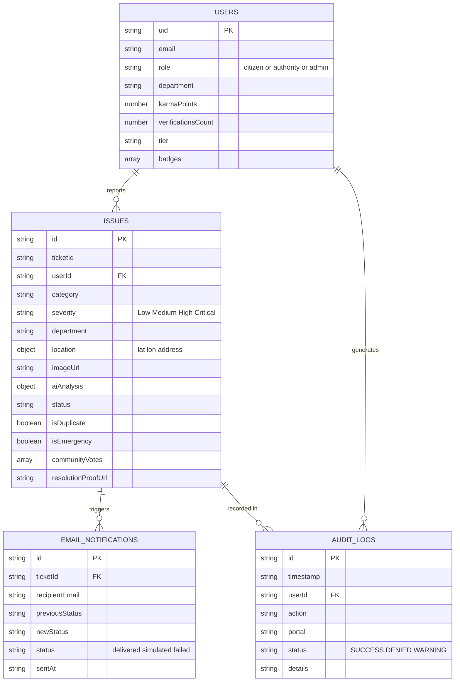

# 08 — Firestore Data Model

Four Firestore collections and their relationships.

```mermaid
erDiagram
    USERS {
        string uid PK
        string email
        string role "citizen or authority or admin"
        string department
        number karmaPoints
        number verificationsCount
        string tier
        array badges
    }

    ISSUES {
        string id PK
        string ticketId
        string userId FK
        string category
        string severity "Low Medium High Critical"
        string department
        object location "lat lon address"
        string imageUrl
        object aiAnalysis
        string status
        boolean isDuplicate
        boolean isEmergency
        array communityVotes
        string resolutionProofUrl
    }

    AUDIT_LOGS {
        string id PK
        string timestamp
        string userId FK
        string action
        string portal
        string status "SUCCESS DENIED WARNING"
        string details
    }

    EMAIL_NOTIFICATIONS {
        string id PK
        string ticketId FK
        string recipientEmail
        string previousStatus
        string newStatus
        string status "delivered simulated failed"
        string sentAt
    }

    USERS ||--o{ ISSUES : "reports"
    USERS ||--o{ AUDIT_LOGS : "generates"
    ISSUES ||--o{ EMAIL_NOTIFICATIONS : "triggers"
    ISSUES ||--o{ AUDIT_LOGS : "recorded in"
```
